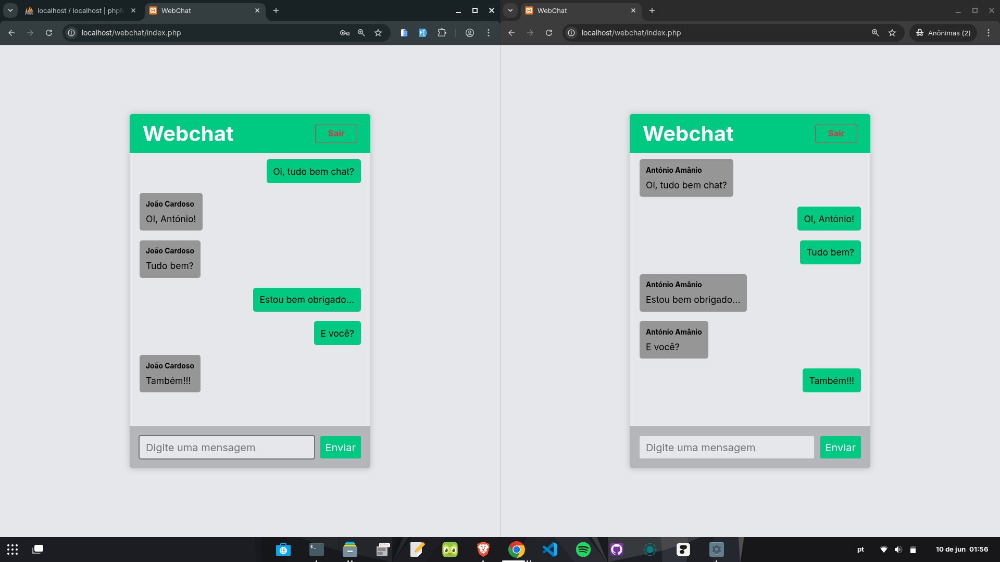

# 💬 WebChat

Este é um projeto de **WebChat simples**, desenvolvido com **HTML**, **CSS**, **JavaScript** e **PHP com PDO**, sem frameworks nem bibliotecas externas. O foco está na aprendizagem dos fundamentos da programação web com tecnologias puras.

<br>



---

## 🧠 Funcionalidades

- Registo de utilizadores
- Login e logout com sessões
- Envio e recepção de mensagens em tempo real (via `fetch`)
- Armazenamento de mensagens numa base de dados MySQL
- Interface limpa, simples e responsiva

---

## 📂 Estrutura do Projeto

```plaintext
/
├── dados.txt
├── index.php
├── login.php
├── register.php
├── LICENSE
│
├── css/
│   ├── chat.css
│   ├── login.css
│   └── register.css
│
├── database/
│   └── databaseCode.sql
│
├── js/
│   ├── getMessages.js
│   ├── sendMessages.js
│   ├── userLogin.js
│   ├── userLogout.js
│   └── userRegister.js
│
├── php/
│   ├── databaseConnection.php
│   ├── getMessages.php
│   ├── sendMessages.php
│   ├── userLogin.php
│   ├── userLogout.php
│   └── userRegister.php
